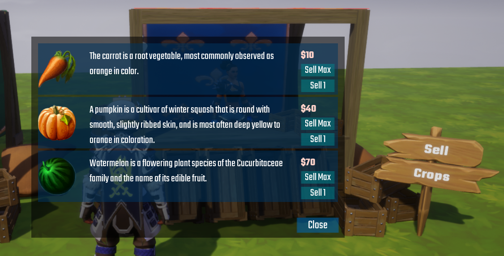

# Buying & Selling

The system includes a basic buying and selling mechanic to help get you started.

For a player to be able to plant crops, they needs seeds.  They can buy seeds at the Seed Stall.

And for the player to make money, they can sell them at the Crop Stall.

