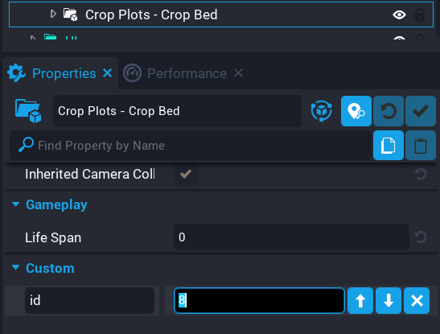

# Creating Plot Beds

So you have your zones for players, you now need to create Crop Beds so they can plant crops in their zone.  By default a plot comes with 4 Crop Beds, but it's very easy to expand the zone and add additional Crop Beds.

!!! warn
	Each Crop Bed must have a unique ID in that zone.  On each Crop Bed object, there is a property called `id`.

See the video below where I expand the amount of Crop Beds in one of the zones.  Pay attention to the size of the zone, which is a trigger that must contain all the Crop Beds, and the setting of the `id` per Crop Bed.

<iframe width="560" height="315" src="https://www.youtube.com/embed/867EWog8cSk" title="YouTube video player" frameborder="0" allow="accelerometer; autoplay; clipboard-write; encrypted-media; gyroscope; picture-in-picture" allowfullscreen></iframe>

