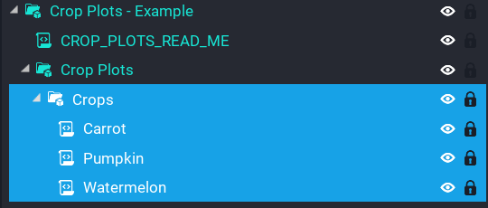
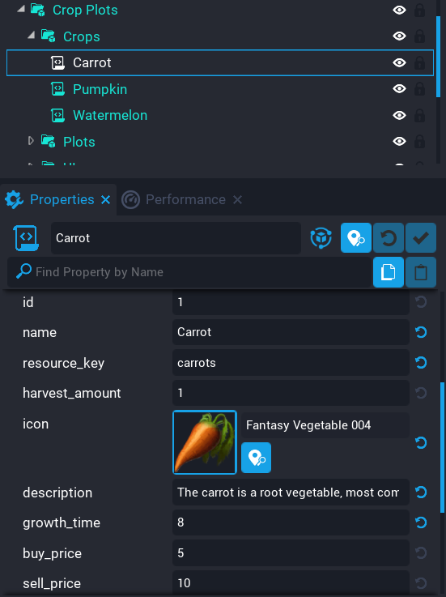

# Creating Crops

The system comes with Carrot, Watermelon, and Pumpkin crops, however you may want to add more crops to your game so players have a wide choice of things to plant.

!!! tip
	Start with the example template and desinstance it so you can modify it to suit your game.

All crops are stored in a folder called `Crops` under the folder `Crop Plots`.

Below are all the properties explained on the `Crop Data` script.

| Property | Description |
| -------- | ----------- |
| id | The ID for this crop.  This must be unique. |
| name | The name of the crop. |
| resource_key | The resource key that will be used when storing this for the player. |
| harvest_amount | The amount the player will receive when the crop is harvested. |
| icon | The icon to use in the UI menus for this crop. |
| description | A description of the crop. |
| growth_time | The time in seconds it takes for this crop to be fully grown. |
| buy_price | The price of the seeds for this crop. |
| sell_price | The price the player will receive when selling this crop. |
| template | The crop template that will be spawned in the world in the crop beds. |

The next following properties control the scale and position of each stage of the crop.  There are 3 stages to a crop that get tweened between to give a nice growing effect for players to see.  These may be confusing, so it's recommended to look at how the existing crops that come with the system is done.  The reason it's done like this is to give as much control to you as possible on the way the crop grows.

!!! tip
	To get a better idea of scale and position, enter play mode and tweak the crops scale or position, copy them, then enter it into the properties on the script.  This way it takes out a little bit of guess work and you will be able to see each stage in local play.

| Property | Description |
| -------- | ----------- |
| stage_1_scale | The scale of the crop object when it's first planted by the player. |
| stage_1_pos | The position of the crop object when it's first planted by the player.  Ideally the crop should start lower down in the ground, and then at each stage after it moves up on the Z direction to give the effect of growning. |
| stage_2_scale | Second stage scale. |
| stage_2_pos | Second stage position. |
| stage_3_scale | Final stage scale. |
| stage_3_pos | Final stage position. |

