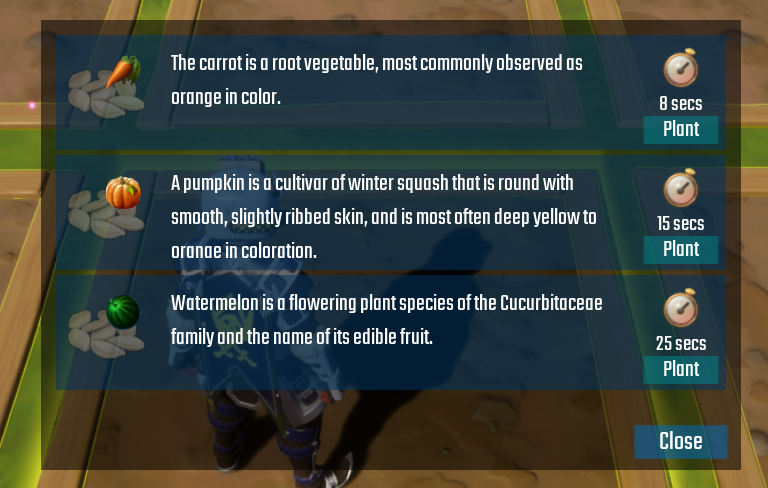

# Planting & Harvesting Crops

When a player enters a zone they own, an outline of all Crop Beds will appear to indicate they are in a zone they own.  They will also get a cross hair appear so they can see which Crop Bed they are looking at so they can plant or harvest.  

When looking at an empty Crop Bed, left click the mouse which will then open up the seed UI so you can pick which seed to plant in this specific Crop Bed.

!!! tip
	For the sake of the example that comes with the system.  Crops have a low growth time.  It's advised to increase the time on these to be more suitable for your game.

Harvesting crops works the same way, look at the Crop Bed that has a fully grown crop, and left click to harvest it.