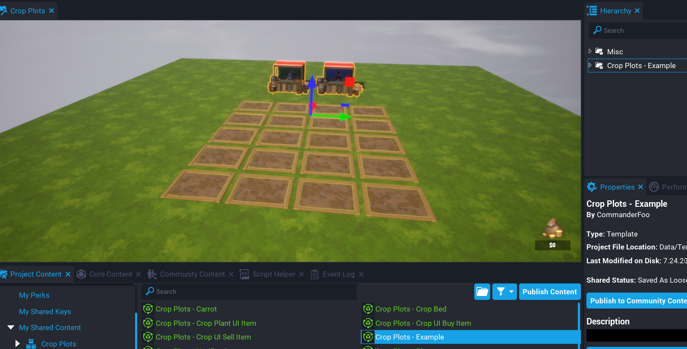

# Quick Start

If you want to just get straight into using the system then follow these steps.

!!! tip
	Make sure to enable "Enable Player Storage" on your Game Settings object, otherwise you will get a warning and nothing will be saved.

1.  Drag and drop the template `Crop Plots - Example` into your hierarchy.
2.  Press `Play`.

The example comes with 1 player zone that contains 20 crop beds.

